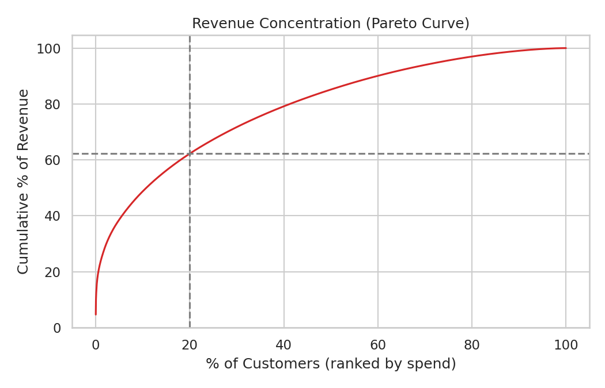
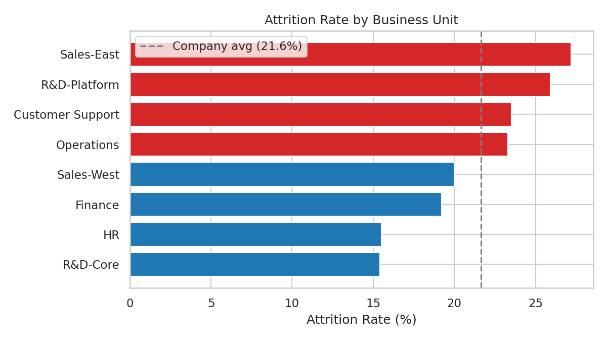
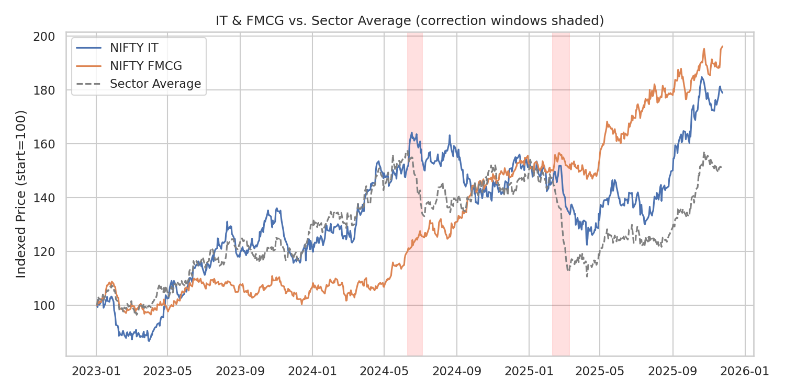

# Data Analyst Portfolio Projects

Three end-to-end data analysis projects covering SQL, Python, statistical testing, and dashboard-ready visualization. Each project folder includes the dataset, SQL queries, Python analysis code, charts, and a full write-up — click a project title below for the complete details.

---

## 1. [Retail Sales Performance & Customer Segmentation](./PROJEC~1)

**Skills:** SQL (CTEs, window functions) · Python (Pandas, NumPy) · RFM Segmentation · A/B Testing (two-proportion z-test) · Tableau

Segmented 5,000+ customers by Recency/Frequency/Monetary value and ran an A/B test comparing two promo campaigns.

**Key findings:**
- Top 20% of customers drive ~62% of total revenue
- Tiered-discount campaign significantly outperformed flat-discount campaign (p < 0.01)

---

## 2. [HR Attrition & Workforce Analytics Dashboard](./PROJEC~2)

**Skills:** SQL · Python (Pandas, NumPy) · Chi-Square Test of Independence · Correlation Analysis · Power BI

Analyzed 1,470 employees to find what actually drives voluntary attrition.

**Key findings:**
- High-attrition departments average a 12.6-month promotion gap vs. 8.1 months company-wide
- Overtime is strongly linked to attrition (χ² = 76.3, p < 0.001)

---

## 3. [NIFTY 50 Sector Performance & Market Trend Analysis](./PROJEC~3)

**Skills:** Python (Pandas, NumPy) · SQL (rolling window functions) · Time-Series Analysis · Correlation Matrices · Tableau

3 years of sector-level index data analyzed for volatility, moving-average crossovers, and correction resilience.

**Key findings:**
- IT and FMCG were the top defensive sectors during both market corrections
- Full 13×13 sector correlation matrix identifies diversification opportunities

---

*Each project folder contains the full dataset, SQL scripts, Python analysis code, all chart figures, and a detailed README.*
